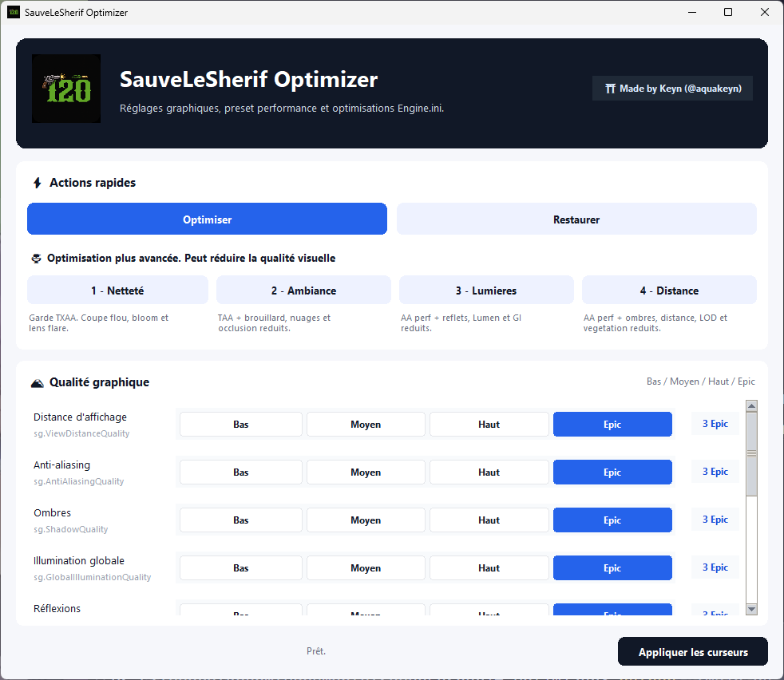
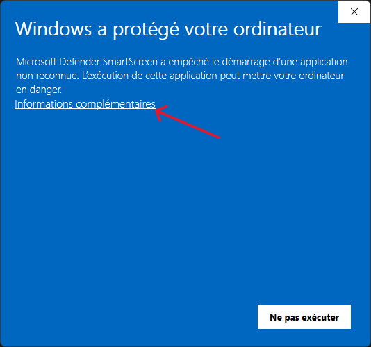
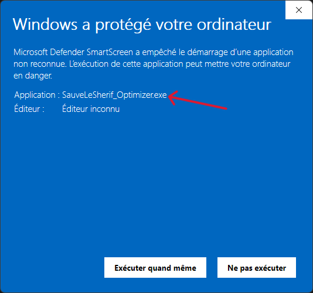
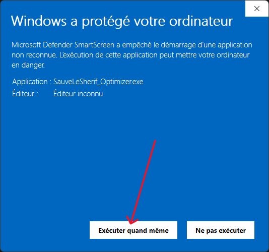

#  SauveLeSherif Optimizer

✨ Optimiseur simple pour **SauveLeSherif**.

## 📥 Téléchargement

➡️ **Télécharger la dernière version :** [SauveLeSherif Optimizer - Dernière release](https://github.com/keynaqua/SauveLeSheriff_Optimizer/releases/download/latest/SauveLeSherif_Optimizer.exe)

➡️ **Voir toutes les versions :** [Historique des releases](https://github.com/keynaqua/SauveLeSheriff_Optimizer/releases)



## 📝 Description

**SauveLeSherif Optimizer** permet de modifier rapidement les réglages graphiques du jeu sans ouvrir manuellement le fichier de configuration.

L'application propose :

- 🎚️ des réglages graphiques via une interface claire ;
- ⚡ un bouton **Optimiser** pour appliquer un preset recommandé ;
- ♻️ un bouton **Restaurer** pour remettre les qualités graphiques par défaut ;
- 🧩 4 boutons **Optimisation supplémentaire** Engine.ini, du plus discret au plus agressif ;
- 🔒 une interface locale, sans compte, sans connexion et sans collecte de données.

Le fichier modifié est celui du jeu, dans le dossier utilisateur Windows :

```text
%LOCALAPPDATA%\SauveLeSherif\Saved\Config\Windows\GameUserSettings.ini
%LOCALAPPDATA%\SauveLeSherif\Saved\Config\Windows\Engine.ini
```

## Benchmark

**Il est recommandé de n'utiliser les opti 1 à 4 qu'en complément des réglages en low, si ça ne suffit pas à rendre le jeu fluide.**  

Voici mes tests personnels des différents profils. Gardez en tête que les optis 1, 2, 3 et 4 sont lancées avec l'opti (profil 0) actif.  
Je tourne sur un portable avec une Rtx4060, un i7-13e gen et 16Go de RAM en DDR5.

| Profil | FPS lobby | FPS in-game |
| --- | ---: | ---: |
| Jeu de base | 25 | 60 |
| 0 - Optimiser | ~75 | 110 |
| 0bis - Tout en low | 90 | 170 |
| 1 - Netteté | ~70 | ~90 |
| 2 - Ambiance + TAA | 85 | 120 |
| 3 - Lumieres et reflets | 110 | 230 |
| 4 - Distance et ombres | 110 | 230+ |

## 🛠️ Installation

1. Télécharge la dernière version ici : [SauveLeSherif Optimizer - Download](https://github.com/keynaqua/SauveLeSheriff_Optimizer/releases/download/latest/SauveLeSherif_Optimizer.exe).
2. Récupère le fichier :

```text
SauveLeSherif_Optimizer.exe
```

3. Place-le où tu veux, par exemple sur le Bureau ou dans un dossier dédié.
4. Lance l'application.

✅ Aucune installation système n'est nécessaire.  
✅ L'application ne demande pas les droits administrateur.  
🛡️ Si Windows Defender affiche un avertissement, suis la section **Windows Defender / SmartScreen** plus bas.  

## 🚀 Lancement

Double-clique sur :

```text
SauveLeSherif_Optimizer.exe
```

### 🛡️ Si Windows Defender / SmartScreen affiche un warning

Windows peut afficher un écran du type :


**Ce warning apparaît parce que l'application n'est pas signée avec un certificat reconnu par Microsoft. Windows ne peut donc pas vérifier l'éditeur, même si l'application est locale et ne demande pas les droits administrateur. Une auto-signature ne retirerait pas cet avertissement pour les autres utilisateurs.**  

### ✅ Comment passer le warning Windows

**Étape 1 - Clique sur "Informations complémentaires"**



**Étape 2 - Vérifie le nom de l'application**



**Étape 3 - Clique sur "Exécuter quand même"**



## 🎉 Bravo ! Le programme devrait maintenant se lancer.

### Optimisation supplementaire Engine.ini

Les boutons **Optimisation supplementaire** servent si le preset de base ne suffit pas. Les options sont triees du gain le moins impactant visuellement au gain le plus agressif :

1. **Image nette** : garde l'AA du jeu/TXAA et coupe seulement les effets camera.
2. **Ambiance + TAA** : passe en TAA et allege brouillard, nuages volumetriques, occlusion.
3. **Lumieres et reflets** : passe en methode AA 1, SSR, reflections, Lumen, illumination dynamique.
4. **Distance et ombres** : methode AA 1, ombres, distance d'affichage, LOD, vegetation.

L'application cree ou met a jour `Engine.ini`, puis le remet en lecture seule pour eviter que le jeu remplace les valeurs.


## ♻️ Reset des paramètres

Pour remettre les réglages graphiques par défaut :

1. Ouvre **SauveLeSherif Optimizer**.
2. Clique sur **Restaurer**.
3. Relance le jeu.

Le reset remet les qualités graphiques à leur valeur par défaut dans l'application.

## 🙌 Crédits

- Application : **SauveLeSherif Optimizer**
- Auteur : **Keyn 🫧 (@aquakeyn on Discord)**  
- Jeu : **Sauve Le Shérif**
- Page de téléchargement : [Releases page](https://github.com/keynaqua/SauveLeSheriff_Optimizer/releases)
- Distribution : [GitHub](https://github.com/keynaqua/SauveLeSheriff_Optimizer)

Ce projet est un outil communautaire non officiel.
